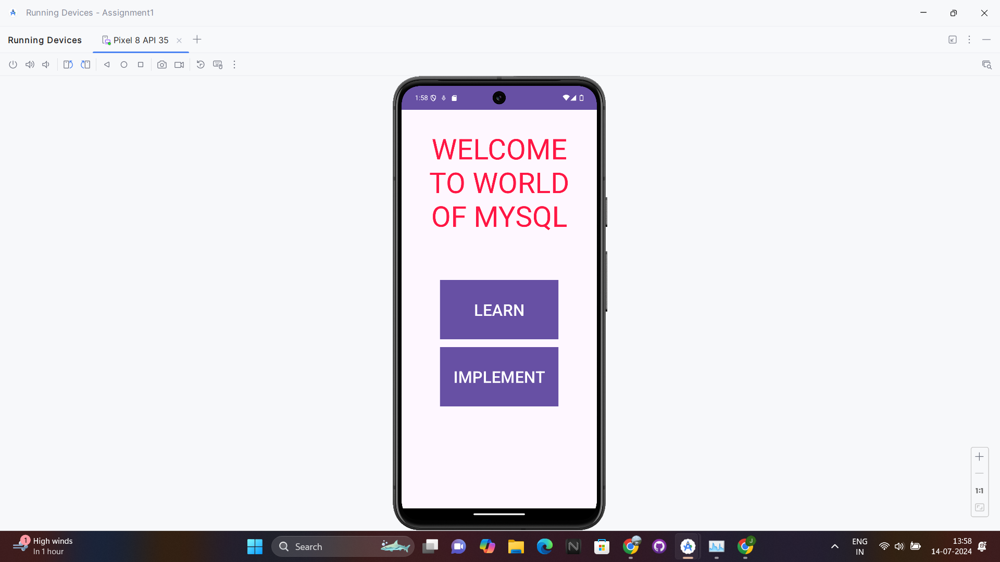
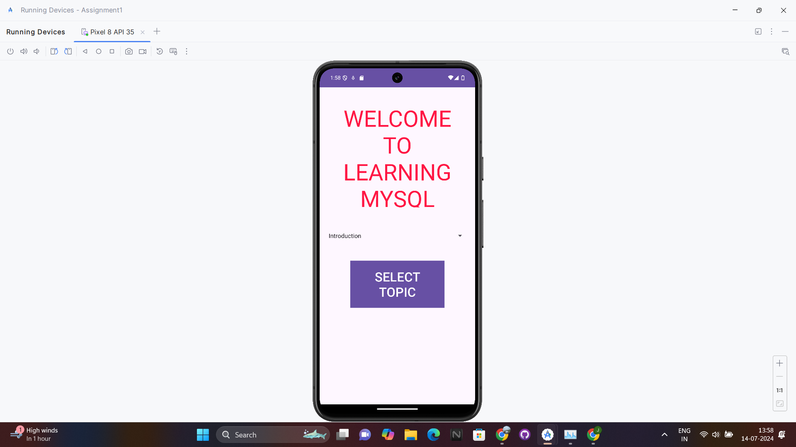
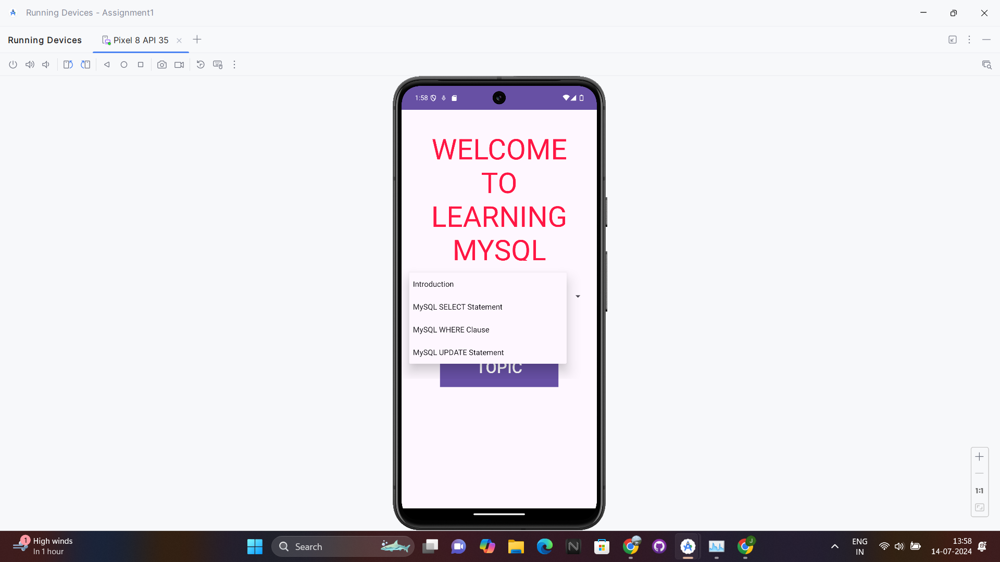
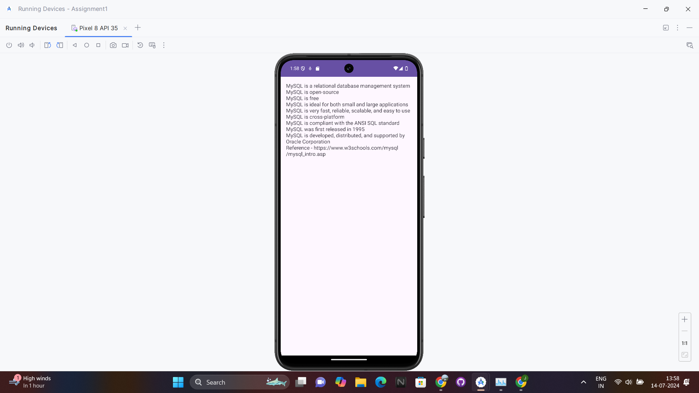
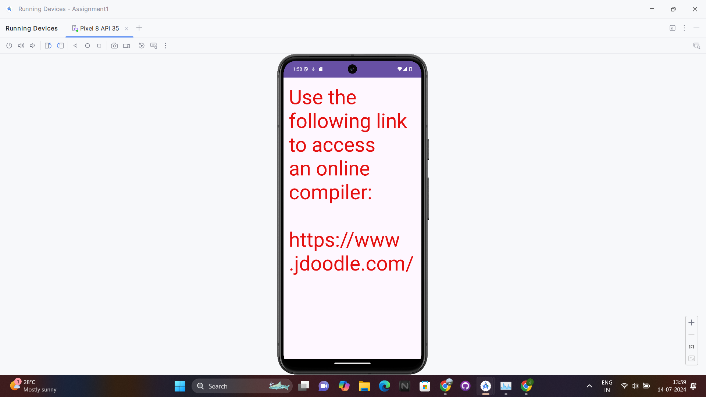

Mobile Application development Assignment#1

# Learn MySQL App

This is a basic learning app developed in Kotlin using Android Studio. The app allows users to learn various topics of MySQL. 

## Features
- Learn SQL
- Implement SQL (link to online compiler)

## Prerequisites

- Android Studio [Download here](https://developer.android.com/studio)
- A Git client [Download here](https://git-scm.com/)
- An Android device or emulator for testing

## Installation

1. **Clone the repository:**

   ```sh
   git clone https://github.com/kushal-ml/LearnMySQL-App.git

2. Open the project in Android Studio:

Open Android Studio.
Click on File > Open....
Navigate to the cloned repository folder and select it.
Click OK.

3. Sync the project with Gradle:

Android Studio should automatically start syncing the project. If not, click on File > Sync Project with Gradle Files.

4. Run the project:

Connect your Android device or start an emulator.
Click on the green Run button or press Shift + F10

5. Usage

1. **Welcome Screen:**
   - On launching the app, you'll see a welcome screen with options to learn mysql or implement mysql.

2. **Learn MySQL**
   - Select a topic from spinner and start reading about that topic.
    

3. **Implement MySQL:**
   - You can find link to online complier where you can practice MySQL








##References - 
https://developer.android.com/guide/components/activities/intro-activities
https://developer.android.com/guide/topics/resources/string-resource
https://developer.android.com/reference/android/widget/AdapterView.OnItemSelectedListener
https://developer.android.com/reference/android/widget/ArrayAdapter
https://developer.android.com/reference/android/view/View
https://developer.android.com/reference/android/view/View.OnClickListener
https://www.w3schools.com/mysql/mysql_sql.asp
